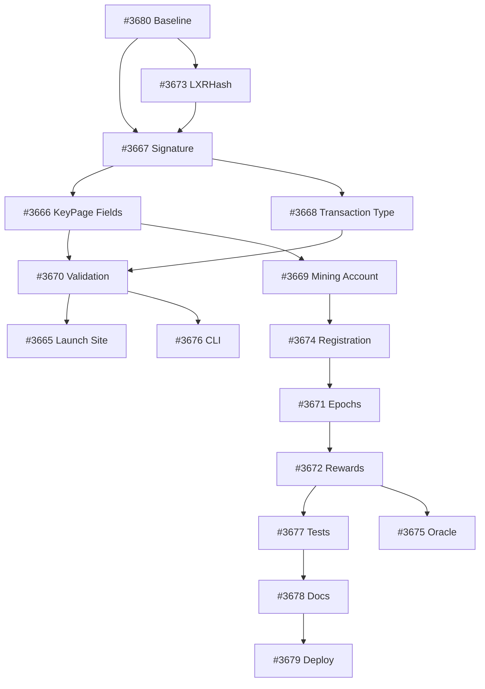

# LXR Mining Implementation Milestone
## Phase 1: Core Implementation (3 months)

### Overview
This milestone outlines the implementation order for LXR mining functionality in Accumulate. Issues are ordered by dependency, ensuring each component builds on previously completed work.

### Implementation Order

#### Stage 1: Foundation (Weeks 1-2) ✅
**Already Completed:**
- [x] **#3680** - LXR Mining Feature Baseline
  - Specifications and prototypes created
  - MR #1111 merged
  
- [x] **#3667** - Implement LxrMiningSignature Type  
  - Core signature type implemented with A+ quality
  - MR #1110 ready for review
  
- [x] **#3673** - Integrate LXRHash Algorithm
  - Real LXR algorithm integrated from branch 3640
  - Memory-hard properties achieved

#### Stage 2: Protocol Integration (Weeks 3-4)
**Next Priority:**

1. **#3666** - Add Mining Fields to KeyPage Schema
   - Add `MiningEnabled` boolean field
   - Add `MiningDifficulty` uint64 field  
   - Add `MiningQuota` uint64 field (optional)
   - Update YAML schemas and regenerate

2. **#3668** - Create Mining Transaction Type
   - Define `SubmitMiningProof` transaction
   - Include fields for proof submission
   - Link to mining account namespace

#### Stage 3: Validation & Execution (Weeks 5-6)

3. **#3670** - Implement Mining Validation and Priority Queue
   - Add mining proof validation to transaction processor
   - Implement priority queue for mined transactions
   - Higher difficulty = higher priority
   - Integration with v2 executor

4. **#3665** - Create Launch Site for v2 Activation
   - Define activation barrier for mining features
   - Guard new code behind version check
   - Prepare for phased rollout

#### Stage 4: Account & Registration (Weeks 7-8)

5. **#3669** - Implement Mining Account Type
   - Create MiningAccount as DataAccount variant
   - Store mining configuration
   - Track mining statistics
   - Namespace isolation for apps

6. **#3674** - Implement Miner Registration System  
   - Use KeyBooks for miner registry
   - Implement stake requirements
   - Registration transaction flow
   - Unregistration/withdrawal logic

#### Stage 5: Rewards & Economics (Weeks 9-10)

7. **#3671** - Implement Mining Epoch Management
   - Define epoch duration (e.g., 1 hour)
   - Track epoch statistics
   - Difficulty adjustment logic
   - Epoch transition handling

8. **#3672** - Implement Mining Reward Distribution
   - Define reward calculation
   - Implement distribution mechanism
   - Support for mining pools
   - Integration with token accounts

#### Stage 6: Testing & Tools (Weeks 11-12)

9. **#3676** - Create Mining CLI Commands
   - `accumulate mining start` - Start mining
   - `accumulate mining status` - Check mining status
   - `accumulate mining register` - Register as miner
   - `accumulate mining stats` - View statistics

10. **#3677** - Create Mining Tests and Test Networks
    - Unit tests for all components
    - Integration tests for mining flow
    - Simulator tests for mining economics
    - TestNet deployment configuration

#### Stage 7: Documentation & Deployment (Week 13)

11. **#3678** - Create Mining Documentation
    - Technical specification updates
    - API documentation
    - Miner setup guide
    - Economic model documentation

12. **#3679** - Mining Deployment and Activation
    - Deployment checklist
    - Activation procedure
    - Monitoring setup
    - Rollback plan

#### Optional Enhancement (Future)

13. **#3675** - Add Oracle Mining Support
    - PegNet-style oracle grading
    - Data quality metrics (Δ⁴)
    - Combined PoW + data quality selection

### Dependencies Graph

### Success Criteria

1. **Technical Excellence**
   - A+ implementation quality
   - Full test coverage (>80%)
   - Performance benchmarks passing
   - Security review completed

2. **Functionality**
   - Mining signatures working end-to-end
   - Registration and staking functional
   - Rewards distribution accurate
   - Difficulty adjustment stable

3. **Documentation**
   - Complete API documentation
   - Miner setup guides
   - Economic model documented
   - Troubleshooting guide

### Risk Mitigation

1. **Performance Risk**: LXR table generation
   - Mitigation: Caching implemented ✅
   - LRU eviction added ✅

2. **Security Risk**: Timing attacks
   - Mitigation: Constant-time comparisons ✅

3. **Economic Risk**: Difficulty manipulation
   - Mitigation: Epoch-based adjustment
   - Multiple validators required

4. **Integration Risk**: Breaking changes
   - Mitigation: Launch site activation
   - Phased rollout plan

### Resource Requirements

- **Development**: 2-3 engineers for 3 months
- **Testing**: 1 QA engineer for final month
- **Documentation**: Technical writer for 2 weeks
- **Infrastructure**: TestNet capacity for mining tests

### Notes

- Stages can overlap where dependencies allow
- Weekly progress reviews recommended
- Security audit before mainnet deployment
- Consider beta program for early miners