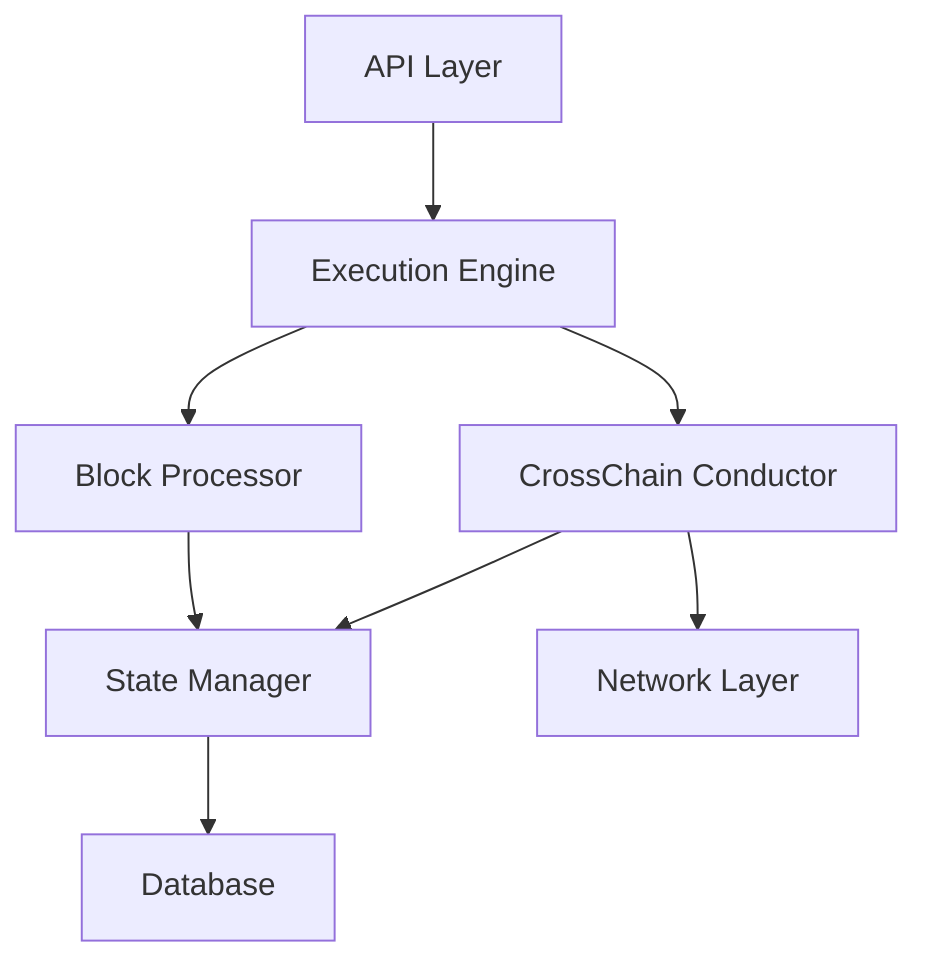

# AI Semantic Guide for Accumulate Codebase

## Semantic Tags and Markers

This document provides semantic context for AI systems analyzing the Accumulate codebase.

## Code Classification

### By Criticality
- **🔴 CRITICAL**: Consensus, cryptography, state management
- **🟡 IMPORTANT**: API handlers, validation, networking
- **🟢 STANDARD**: Utilities, helpers, logging

### By Complexity
- **🧠 COMPLEX**: Gap recovery, cross-chain messaging, consensus
- **📊 MODERATE**: API implementation, transaction processing
- **📝 SIMPLE**: Data structures, utilities, configuration

### By Safety
- **⚠️ UNSAFE**: Requires mutex, modifies global state, consensus-critical
- **🔒 SAFE**: Read-only, pure functions, side-effect free

## Component Relationships

### Dependency Graph


### Data Flow
```
User Request → API → Validation → Execution → State Change → Response
                                       ↓
                              Cross-Chain Message
                                       ↓
                                     CCC
                                       ↓
                              Remote Partition
```

## Key Interfaces

### Critical Interfaces
```go
// Dispatcher - Routes messages between partitions
type Dispatcher interface {
    Submit(ctx context.Context, dest *url.URL, envelope *messaging.Envelope) error
}

// Conductor - Manages cross-chain messaging
type Conductor interface {
    Start() error
    Stop() error
    QueueMessage(dest *url.URL, msg messaging.Message)
}

// Executor - Processes transactions
type Executor interface {
    Execute(batch *ExecutorBatch) error
}
```

## State Machines

### Gap Recovery State Machine
```
NORMAL → GAP_DETECTED → REQUESTING → RECOVERING → NORMAL
   ↑                                      ↓
   └──────────────────────────────────────┘
```

### Message Delivery State Machine
```
QUEUED → SENDING → SENT → ACKNOWLEDGED
           ↓         ↓
        FAILED → RETRY
```

## Invariants

### System Invariants (MUST MAINTAIN)
1. **Message Ordering**: Messages must be delivered in sequence order
2. **State Consistency**: All validators must agree on state
3. **No Message Loss**: Every message must be delivered eventually
4. **Deterministic Execution**: Same input must produce same output

### Performance Invariants (SHOULD MAINTAIN)
1. **Batch Size**: Keep between 1-100 messages
2. **Timeout**: Network calls should timeout within 30s
3. **Memory Usage**: Stay under 300MB per validator
4. **Queue Depth**: Prevent unbounded queue growth

## Common Patterns

### Pattern: Error Wrapping
```go
// PATTERN: Always wrap errors with context
if err != nil {
    return errors.BadRequest.WithFormat("failed to process %v", id).Wrap(err)
}
```

### Pattern: State Locking
```go
// PATTERN: Always lock before state modification
state.Lock()
defer state.Unlock()
state.value = newValue
```

### Pattern: Context Propagation
```go
// PATTERN: Always propagate context
func (c *Component) Method(ctx context.Context, ...) error {
    return c.subComponent.Method(ctx, ...)
}
```

## Testing Patterns

### Unit Test Pattern
```go
func TestComponent_Method(t *testing.T) {
    t.Run("SubTest", func(t *testing.T) {
        // Arrange
        component := NewComponent()
        
        // Act
        result := component.Method()
        
        // Assert
        require.NoError(t, result)
    })
}
```

### Integration Test Pattern
```go
func TestIntegration_Scenario(t *testing.T) {
    // Setup environment
    env := setupTestEnvironment(t)
    defer env.Cleanup()
    
    // Execute scenario
    // Verify results
}
```

## Code Smells to Detect

### 🚨 Red Flags
- Direct state modification without locking
- Unbounded loops without timeout
- Ignored errors in critical paths
- Missing nil checks on pointers
- Hardcoded configuration values

### ⚠️ Warning Signs
- Functions over 100 lines
- Deeply nested conditionals (>3 levels)
- Duplicate code blocks
- Missing test coverage
- Unclear variable names

## Optimization Opportunities

### Performance Hotspots
1. **Message Serialization**: Consider caching
2. **State Queries**: Add indexes
3. **Network Calls**: Batch when possible
4. **Lock Contention**: Reduce critical sections

### Memory Optimization
1. **Message Buffers**: Pool and reuse
2. **State Cache**: Implement LRU
3. **Goroutine Leaks**: Ensure cleanup
4. **Large Arrays**: Use slices efficiently

## AI Task Templates

### Template: Add New Feature
1. Understand existing patterns
2. Design with interfaces
3. Write tests first
4. Implement incrementally
5. Document changes
6. Update indexes

### Template: Fix Bug
1. Reproduce issue
2. Add failing test
3. Fix implementation
4. Verify test passes
5. Check for regressions
6. Document fix

### Template: Optimize Performance
1. Profile current state
2. Identify bottleneck
3. Design optimization
4. Benchmark before/after
5. Verify correctness
6. Document changes

## Natural Language Mappings

### Domain Terms
- "partition" = BVN (Block Validator Network)
- "conductor" = CCC (CrossChain Conductor)
- "gap" = Missing sequence numbers
- "synthetic" = System-generated transaction
- "anchor" = Checkpoint/proof

### Action Verbs
- "queue" = Add to processing queue
- "dispatch" = Send to remote partition
- "recover" = Restore from failure state
- "validate" = Check correctness
- "execute" = Process transaction

## Query Optimization for AI

### To Find Implementation
```
"Where is X implemented?" → Search for "type X struct" or "func.*X"
"How does X work?" → Look for X.go and X_test.go files
"What calls X?" → Search for "X(" across codebase
```

### To Understand Flow
```
"How do messages flow?" → Start at conductor.go
"Where do transactions process?" → Check execute/v2/
"How is state managed?" → Look at state.go files
```

### To Debug Issues
```
"Why is X failing?" → Check X_test.go for examples
"What errors can occur?" → Search for "return.*error"
"How to handle X error?" → Look for "errors.*X"
```

## Contextual Hints

### When Modifying CrossChain Code
- Always consider both sender and receiver
- Maintain sequence ordering
- Handle partition failures
- Test gap recovery scenarios

### When Changing State
- Acquire locks before modification
- Consider concurrent access
- Validate state transitions
- Ensure persistence

### When Adding APIs
- Follow existing patterns
- Add validation
- Include tests
- Update documentation

## File Naming Conventions

### Standard Patterns
- `*_test.go` - Test files
- `*_mock.go` - Mock implementations
- `*_gen.go` - Generated code
- `interface.go` - Interface definitions
- `types.go` - Type definitions
- `errors.go` - Error definitions

## Important Metrics

### Code Quality Metrics
- Test Coverage: Target 80%
- Cyclomatic Complexity: Keep under 10
- Function Length: Max 50 lines
- Package Coupling: Minimize dependencies

### Runtime Metrics
- Message Latency: < 500ms p99
- Gap Recovery Time: < 10s
- Memory Per Node: < 300MB
- CPU Usage: < 50% average