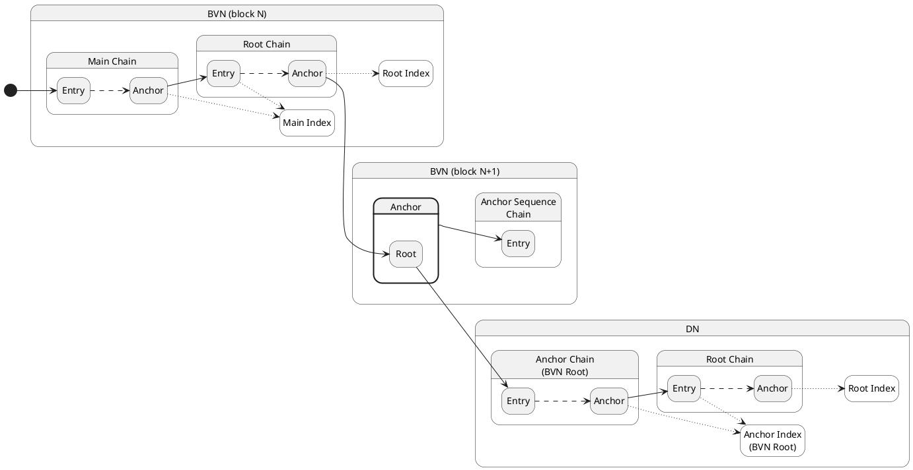

# Chains

### Anchoring

Dashed arrows between a chain entry and anchor indicate that (1) more than one
entry may be added but only one anchor is created per block and (2) the anchor
is a hash calculated from all the entries up to that point.

Dotted arrows between a chain entry or anchor indicate that the *index* of the
entry or anchor is added to the index chain, not the hash.