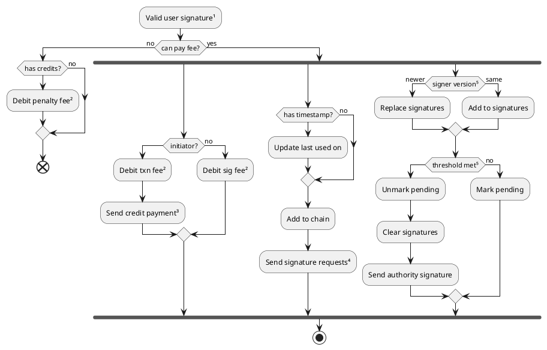
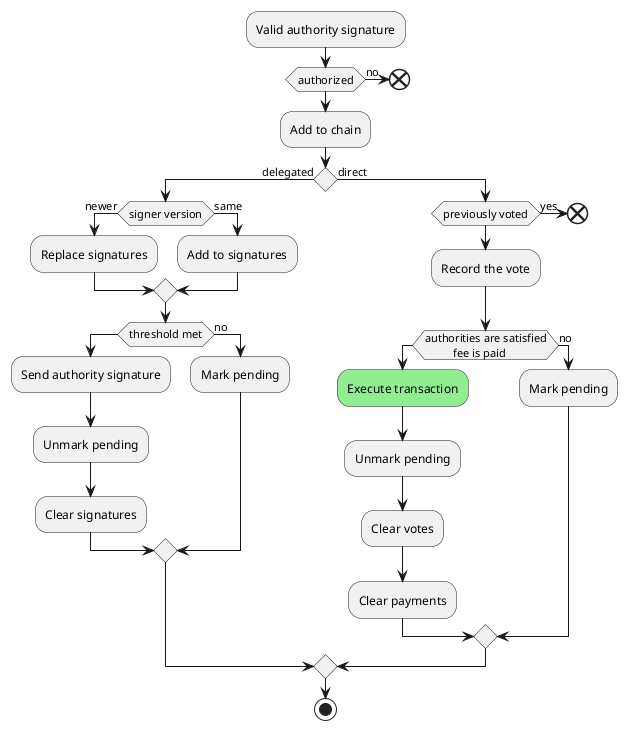

# Signatures

The diagrams below omit validation checks and assume the signature is valid.

⁰ ¹ ² ³ ⁴ ⁵ ⁶ ⁷ ⁸ ⁹

### Execute user signature

#### ¹Signature validity

A user signature is valid if and only if:

- It signs a valid transaction. If the user submits a signature without a
  transaction, and the signer has never previously received that transaction,
  the signature will be rejected.
- It is a key signature or a delegated signature (single- or multi-level)
  containing a key signature.
- It is submitted to the correct partition. Normally routing is handled
  transparently by the API, but if a transaction is intentionally or
  unintentionally submitted directly to the wrong partition, it is rejected.
- It has a timestamp if it is the signature that initiates the transaction.
- It has a signer URL that corresponds to a key page, lite identity, or lite
  token account.
- Its signer is authorized to sign the transaction. Lite accounts are only
  authorized to sign transactions for accounts within the same lite identity.
  Key pages may be configured to prohibit signing certain types of transactions.
- Its signer version matches the signer's version.
- Its public key and key type matches one of the signer's key entries.
- If it specifies a timestamp, that timestamp is greater than the signer's last
  used on field. The timestamp does not have any specific meaning.
- Its signer has a non-zero credit balance.

#### ²Fees

- The penalty fee for a signer that cannot pay for its signature is the smallest
  possible fee, 0.01 credits.
- The base fee for a signature is 0.01 credits. The fee may increase if the
  signature is delegated, remote, or larger than 256B.
- The initiator of a transaction must pay the transaction fee. See the
  transaction fee schedule for details.

#### ³Credit payment

When a signature contributes credits towards paying the transaction fee, the
signer informs the principal of the payment via a credit payment message. When a
signature initiates a transaction, the signer informs the principal via a credit
payment message that the transaction has been initiated. If the same signature
contributes towards paying the transaction fee and initiates the transaction, a
single credit payment message is sent for both purposes.

As of 1.1, the signature that initiates the transaction pays the full
transaction fee and no other signature may contribute to paying the fee. When
this signature is processed, the signer informs the principal via a credit
payment message that the transaction has been initiated and paid for.

#### ⁴Signature request

When a signature initiates a transaction, the signer sends a signature request
to the principal. Upon receipt of this message the principal marks the
transaction as pending and sends a signature request to its authorities. The
initiator signature also sends a signature request to any additional authorities
required by the transaction. Thus all (direct) authorities that must sign the
transaction are notified of its existence.

#### ⁵Signer versioning and the active signature set

Each signer of a transaction maintains a set of signatures that are active for
that transaction. When a signature is received, if the active signature set is
empty or the signatures already in the set match the new signature's signer
version, the new signature is appended to the set. However if the new signature
is of a newer version, the active signature set is cleared before the new
signature is added.

Once any of an authority's signers has sufficient signatures in its active
signature set to satisfy the signer's and authority's thresholds, the authority
sends an authority signature and empties the active signature set of all of its
signers.

If multiple signatures are received for the same key entry of a signer, the
first signature is recorded and the remainder are discarded. Each key entry may
sign the transaction at most once.

### Execute authority signature

