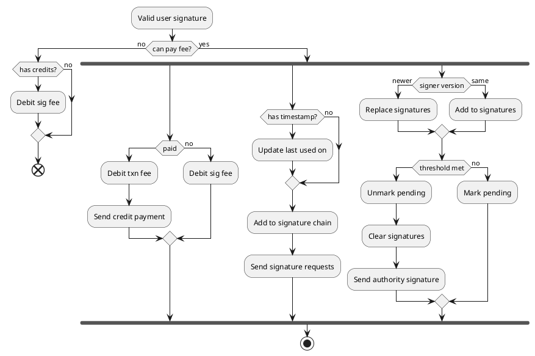
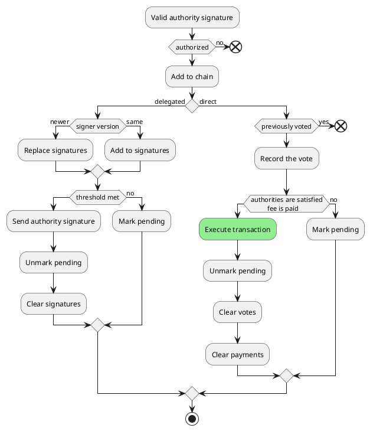

# Signatures

The diagrams below omit validation checks and assume the signature is valid.

### Execute user signature

```plantuml
@startuml
:Valid user signature;

if (can pay fee?) then (no)
  if (has credits?) then
    :Debit sig fee;
  else (no)
  endif
  end

else (yes)
  fork
    if (paid) then
      :Debit txn fee;
      :Send credit payment;
    else (no)
      :Debit sig fee;
    endif

  fork again
    if (has timestamp?) then
      :Update last used on;
    else (no)
    endif

    :Add to signature chain;

    :Send signature requests;

  fork again
    if (signer version) is (newer) then
      :Replace signatures;
    else (same)
      :Add to signatures;
    endif

    if (threshold met) then
      :Unmark pending;
      :Clear signatures;
      :Send authority signature;
    else (no)
      :Mark pending;
    endif

  end fork

  stop
endif
@enduml
```

### Execute authority signature

```plantuml
@startuml
:Valid authority signature;

if (authorized) then (no)
  end
endif

:Add to chain;

skinparam conditionStyle diamond
if () then
  -> delegated;

  skinparam conditionStyle normal
  if (signer version) is (newer) then
    :Replace signatures;
  else (same)
    :Add to signatures;
  endif

  if (threshold met) then
    :Send authority signature;
    :Unmark pending;
    :Clear signatures;
  else (no)
    :Mark pending;
  endif

else (direct)
  if (previously voted) then (yes)
    end
  else
    :Record the vote;
  endif

  skinparam conditionStyle normal
  if (authorities are satisfied
          fee is paid) then
    #lightgreen:Execute transaction;
    :Unmark pending;
    :Clear votes;
    :Clear payments;
  else (no)
    :Mark pending;
  endif

endif

stop
@enduml
```