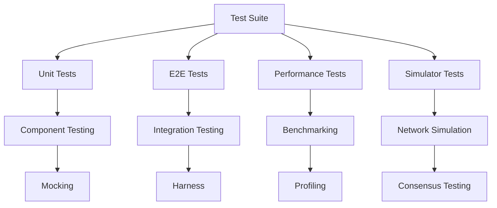

# AI Assistant Guidance for Accumulate Network Testing

## Overview

This document provides structured guidance for AI assistants to effectively understand, navigate, and contribute to the Accumulate Network test suite. It includes patterns, templates, and decision trees optimized for AI-assisted development.

## AI-Optimized Documentation Structure

### 🎯 **Context Hierarchy**
```
1. Project Context: Accumulate Network (blockchain/distributed ledger)
2. Domain Context: Testing framework for consensus, transactions, networking
3. Technical Context: Go-based test suite with simulation capabilities
4. Task Context: Specific testing objective (unit, e2e, performance, debugging)
```

### 🧠 **Knowledge Graph**


## Decision Trees for AI Assistants

### 🤔 **Test Type Selection**
```
Question: What type of test is needed?
├── Testing single function/method? → Unit Test (unit-tests.md)
├── Testing component interaction? → Integration Test (e2e-tests.md)
├── Testing performance/scalability? → Performance Test (performance-tests.md)
├── Testing network behavior? → Simulator Test (simulator-tests.md)
└── Debugging existing test? → Debugging Guide (debugging.md)
```

### 🔍 **Debugging Decision Tree**
```
Problem: Test is failing
├── Flaky/intermittent failure?
│   ├── Yes → debugging.md (Lines 500-600) + test-maintenance.md (Lines 200-400)
│   └── No → Continue
├── Performance/timeout issue?
│   ├── Yes → debugging.md (Lines 600-700) + performance-tests.md
│   └── No → Continue
├── Race condition suspected?
│   ├── Yes → debugging.md (Lines 300-400) + "go test -race"
│   └── No → Continue
└── Logic/assertion error? → debugging.md (Lines 100-200) + specific test guide
```

### 🚀 **CI/CD Integration Decision Tree**
```
Task: Setting up CI/CD
├── GitLab CI? → ci-cd.md (Lines 100-300)
├── GitHub Actions? → ci-cd.md (Lines 300-500)
├── Performance testing in CI? → ci-cd.md (Lines 500-700)
└── Monitoring/alerts? → ci-cd.md (Lines 700-900)
```

## Code Pattern Templates

### 📝 **Unit Test Template**
```go
// Template for unit tests - use this pattern
func TestComponentName_MethodName_ExpectedBehavior(t *testing.T) {
    // Arrange
    testCases := []struct {
        name     string
        input    InputType
        expected ExpectedType
        wantErr  bool
    }{
        {
            name:     "success case description",
            input:    validInput,
            expected: expectedOutput,
            wantErr:  false,
        },
        {
            name:     "error case description", 
            input:    invalidInput,
            expected: zeroValue,
            wantErr:  true,
        },
    }
    
    for _, tc := range testCases {
        t.Run(tc.name, func(t *testing.T) {
            // Act
            result, err := ComponentName.MethodName(tc.input)
            
            // Assert
            if tc.wantErr {
                require.Error(t, err)
                return
            }
            require.NoError(t, err)
            assert.Equal(t, tc.expected, result)
        })
    }
}
```

### 🔄 **E2E Test Template**
```go
// Template for E2E tests - use this pattern
func TestE2E_FeatureName_Scenario(t *testing.T) {
    // Setup test environment
    sim := simulator.New(t, 3) // 3 nodes
    sim.InitFromGenesis()
    
    // Create test accounts/data
    alice := sim.CreateAccount("alice")
    bob := sim.CreateAccount("bob")
    
    // Execute test scenario
    txn := &TransactionType{
        From: alice.Url(),
        To:   bob.Url(),
        // ... transaction details
    }
    
    // Submit and wait for completion
    sim.SubmitTxn(txn)
    sim.StepUntil(
        Txn(txn.GetHash()).Succeeds(),
        Txn(txn.GetHash()).Produced().Succeeds(),
    )
    
    // Verify results
    account := sim.GetAccount(bob.Url())
    require.Equal(t, expectedState, account.State)
}
```

### 📊 **Benchmark Test Template**
```go
// Template for benchmark tests - use this pattern
func BenchmarkFeatureName_Operation(b *testing.B) {
    // Setup (not measured)
    setup := prepareTestData()
    
    b.ResetTimer() // Start measuring from here
    
    for i := 0; i < b.N; i++ {
        // Operation to benchmark
        result := performOperation(setup)
        
        // Prevent compiler optimization
        _ = result
    }
}
```

## AI Assistant Workflows

### 🔧 **Test Creation Workflow**
1. **Analyze Request**: Determine test type and scope
2. **Select Template**: Choose appropriate pattern from above
3. **Gather Context**: Review related existing tests
4. **Generate Code**: Use template with specific details
5. **Add Documentation**: Include test purpose and expected behavior
6. **Suggest Validation**: Recommend how to verify the test

### 🐛 **Debugging Workflow**
1. **Identify Symptoms**: Parse error messages and failure patterns
2. **Classify Issue**: Use decision tree to categorize problem
3. **Suggest Diagnostics**: Recommend specific debugging commands
4. **Provide Solutions**: Offer targeted fixes based on issue type
5. **Recommend Prevention**: Suggest ways to avoid similar issues

### 🚀 **Performance Analysis Workflow**
1. **Establish Baseline**: Identify current performance metrics
2. **Identify Bottlenecks**: Use profiling tools and analysis
3. **Suggest Optimizations**: Recommend specific improvements
4. **Validate Changes**: Provide benchmarking approach
5. **Monitor Regression**: Set up ongoing performance tracking

## Common Patterns & Anti-Patterns

### ✅ **Good Patterns**
```go
// Use table-driven tests for multiple scenarios
func TestValidation(t *testing.T) {
    tests := []struct {
        name string
        input string
        valid bool
    }{
        {"valid input", "valid", true},
        {"invalid input", "invalid", false},
    }
    // ... test implementation
}

// Use require for critical assertions, assert for non-critical
require.NoError(t, err) // Test stops if this fails
assert.Equal(t, expected, actual) // Test continues if this fails

// Use meaningful test names
func TestAccountManager_CreateAccount_WithValidInput_ReturnsAccount(t *testing.T)
```

### ❌ **Anti-Patterns to Avoid**
```go
// Don't use generic test names
func TestAccount(t *testing.T) // Too generic

// Don't ignore errors in tests
result, _ := operation() // Should handle or assert on error

// Don't use magic numbers without explanation
time.Sleep(100 * time.Millisecond) // Why 100ms?

// Don't create tests that depend on external state
func TestWithRealDatabase(t *testing.T) // Should use mocks/test DB
```

## Semantic Tags for AI Context

### 🏷️ **Test Classification Tags**
- `#unit-test` - Tests single components in isolation
- `#integration-test` - Tests component interactions
- `#e2e-test` - Tests complete user workflows
- `#performance-test` - Tests performance characteristics
- `#benchmark-test` - Measures performance metrics
- `#simulation-test` - Tests network behavior
- `#flaky-test` - Tests with intermittent failures
- `#slow-test` - Tests that take significant time

### 🏷️ **Component Tags**
- `#consensus` - Consensus mechanism testing
- `#transaction` - Transaction processing
- `#networking` - Network communication
- `#storage` - Data persistence
- `#api` - API functionality
- `#security` - Security features
- `#validation` - Input validation
- `#serialization` - Data encoding/decoding

### 🏷️ **Tool Tags**
- `#simulator` - Uses network simulator
- `#harness` - Uses test harness
- `#mock` - Uses mock objects
- `#profiling` - Performance profiling
- `#debugging` - Debugging tools
- `#ci-cd` - Continuous integration

## AI-Friendly Command Reference

### 🤖 **Commands by Intent**
```bash
# Intent: Run specific test
go test -v -run TestName ./path/to/package

# Intent: Debug failing test
go test -v -run TestName ./path/to/package 2>&1 | tee debug.log

# Intent: Check performance
go test -bench=BenchmarkName -benchmem ./path/to/package

# Intent: Find flaky tests
go test -count=100 -run TestName ./path/to/package

# Intent: Profile memory usage
go test -memprofile=mem.prof -run TestName ./path/to/package

# Intent: Check race conditions
go test -race -run TestName ./path/to/package
```

### 🔍 **Diagnostic Commands**
```bash
# Check test coverage
go test -coverprofile=coverage.out ./...
go tool cover -html=coverage.out

# Analyze test performance
go test -bench=. -benchmem -cpuprofile=cpu.prof ./...
go tool pprof cpu.prof

# Find slow tests
go test -v ./... 2>&1 | grep -E "PASS|FAIL" | sort -k3 -n

# Check for test dependencies
go test -list=. ./... | grep -E "Test|Benchmark"
```

## Integration with Development Workflow

### 📋 **Pre-commit Checklist for AI**
1. Run relevant tests: `make test-unit` or specific test command
2. Check test coverage: Ensure new code is tested
3. Verify performance: Run benchmarks if performance-critical
4. Check for flaky tests: Run tests multiple times if suspected
5. Update documentation: Add/update test documentation

### 🔄 **Code Review Checklist for AI**
1. **Test Quality**: Are tests comprehensive and maintainable?
2. **Performance**: Do tests run efficiently?
3. **Reliability**: Are tests deterministic and not flaky?
4. **Documentation**: Are test purposes and expectations clear?
5. **Integration**: Do tests work with CI/CD pipeline?

## Error Pattern Recognition

### 🚨 **Common Error Signatures**
```
Pattern: "panic: runtime error: invalid memory address"
→ Likely: Nil pointer dereference
→ Action: Check for nil checks before dereferencing
→ Reference: debugging.md (Lines 400-500)

Pattern: "timeout exceeded"
→ Likely: Deadlock or slow operation
→ Action: Check for goroutine leaks, increase timeout, or optimize
→ Reference: debugging.md (Lines 600-700)

Pattern: "race detected"
→ Likely: Concurrent access to shared resource
→ Action: Add proper synchronization (mutex, channels)
→ Reference: debugging.md (Lines 300-400)

Pattern: "connection refused"
→ Likely: Service not running or port conflict
→ Action: Check service status, verify port configuration
→ Reference: debugging.md (Lines 200-300)
```

## Continuous Learning

### 📚 **Knowledge Updates**
- Monitor test suite changes and update patterns
- Track new testing tools and integrate guidance
- Collect feedback on AI-generated tests and improve templates
- Update decision trees based on common issues

### 🔄 **Feedback Loop**
- Analyze successful AI-generated tests for pattern refinement
- Track debugging success rates to improve diagnostic guidance
- Monitor CI/CD integration effectiveness
- Update documentation based on user interactions

---

*This guidance document is designed to be consumed by AI assistants to provide better testing support. It should be updated as the test suite evolves and new patterns emerge.*
