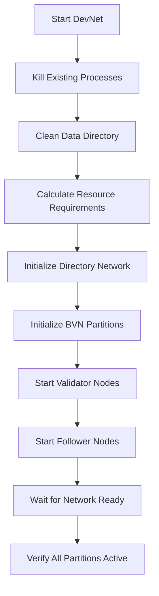

# DevNet Design and Architecture

## Executive Summary

The Accumulate DevNet is a sophisticated local development and testing environment that simulates a complete blockchain network with configurable topology. It supports flexible partition (BVN) and validator configurations, enabling comprehensive testing of network behaviors including cross-chain messaging, consensus, and failure recovery mechanisms.

## Architecture Overview

### Core Components

```
┌──────────────────────────────────────────────────────────┐
│                     DevNet Orchestrator                   │
│  (devnet_config.sh / accumulated run devnet)             │
└────────────┬─────────────────────────────────────────────┘
             │
             ├─── Directory Network (DN)
             │    ├── Validators (configurable 1-N)
             │    └── Followers (configurable 0-N)
             │
             ├─── Block Validator Network 0 (BVN0)
             │    ├── Validators (configurable 1-N)
             │    └── Followers (configurable 0-N)
             │
             ├─── Block Validator Network 1 (BVN1)
             │    ├── Validators (configurable 1-N)
             │    └── Followers (configurable 0-N)
             │
             └─── ... (up to N BVNs)
```

### Network Topology

1. **Directory Network (DN)**
   - Central identity and routing registry
   - Maintains global state about all partitions
   - Handles account creation and routing decisions
   - Single logical network, can have multiple validators

2. **Block Validator Networks (BVNs)**
   - Independent blockchain partitions
   - Process transactions for accounts assigned to them
   - Communicate via CrossChain Conductor (CCC)
   - Each BVN maintains its own consensus

3. **CrossChain Conductor (CCC)**
   - Embedded in each validator node
   - Manages cross-partition message delivery
   - Implements gap recovery via simple index-based mechanism
   - Supports pause/resume for testing (with testnet build tag)

## Configuration System

### Flexible Configuration Parameters

The DevNet supports dynamic configuration through multiple mechanisms:

#### Command-Line Parameters
```bash
go run ./cmd/accumulated run devnet \
  --bvns <number>        # Number of BVN partitions
  --validators <number>  # Validators per partition
  --followers <number>   # Followers per partition
  --port <base_port>     # Starting port number
  --work-dir <path>      # Data directory
  --name <network_name>  # Network identifier
  --reset               # Clean state before starting
```

#### Configuration Files
```bash
# devnet_configs/example.conf
BVNS=3
VALIDATORS=3
FOLLOWERS=1
BASE_PORT=26656
```

#### Pre-defined Profiles
- **minimal**: 2 BVNs, 1 validator, 0 followers (quick testing)
- **standard**: 2 BVNs, 3 validators, 1 follower (balanced)
- **large**: 3 BVNs, 3 validators, 2 followers (stress testing)
- **multi**: 5 BVNs, 2 validators, 1 follower (cross-chain testing)
- **stress**: 5 BVNs, 3 validators, 2 followers (maximum load)

### Port Allocation Strategy

Each node requires 4 ports for different services:

```
Node Port Allocation:
├── RPC Port     (base + 0)  - RPC API endpoint
├── P2P Port     (base + 1)  - Peer-to-peer communication
├── Metrics Port (base + 2)  - Prometheus metrics
└── API Port     (base + 3)  - JSON-RPC v2 API

Example for 3 BVNs with 2 validators, 1 follower:
DN:
  Node 0: 26656-26659
  Node 1: 26660-26663
  Node 2: 26664-26667
BVN0:
  Node 0: 26668-26671
  Node 1: 26672-26675
  Node 2: 26676-26679
BVN1:
  Node 0: 26680-26683
  ...
```

Total ports required: `(validators + followers) × (1 + BVNs) × 4`

## Process Management

### Initialization Flow



### Health Monitoring

The DevNet manager continuously monitors:
1. **Process Health**: PID tracking and liveness checks
2. **API Availability**: HTTP endpoint responsiveness
3. **Network Formation**: Peer discovery and consensus
4. **Partition Communication**: Cross-chain message flow

## CrossChain Conductor Integration

### Gap Recovery Mechanism

The CCC implements a simple yet effective gap recovery system:

#### Core Design
```go
type DestinationSendState struct {
    Destination    *url.URL
    SentTxIndex    uint64  // Last successfully sent sequence
    CurrentTxIndex uint64  // Latest available sequence
    Messages       map[uint64]messaging.Message
}
```

#### Recovery Flow
1. **Normal Operation**: Advance SentTxIndex on successful sends
2. **Failure Handling**: Keep SentTxIndex unchanged on failure
3. **Gap Detection**: Destination reports LastKnownSequence < SentTxIndex
4. **Recovery**: Reset SentTxIndex to LastKnownSequence
5. **Batch Send**: Next send includes all messages from reset point

### Testing Features

#### Pause/Resume Capability (testnet build)
```bash
# Build with testnet features
go build -tags testnet -o accumulated ./cmd/accumulated

# HTTP endpoints for control
curl -X POST http://localhost:27010/debug/ccc/pause   # Pause partition
curl -X POST http://localhost:27010/debug/ccc/resume  # Resume partition
curl http://localhost:27010/debug/ccc/status         # Check status
```

#### Interactive Testing Interface
```bash
./interactive_pause_test.sh
# Menu options:
# - Pause/resume individual partitions
# - Monitor gap detection
# - Run test transactions
# - View real-time logs
```

## Resource Management

### Memory Requirements

| Component | Memory per Node | Calculation |
|-----------|----------------|-------------|
| Validator | 200-300 MB | Active consensus, full state |
| Follower | 150-200 MB | Passive sync, read-only state |
| Base overhead | 500 MB | Shared libraries, runtime |

Example: 3 BVNs, 3 validators, 1 follower each
- Total nodes: 16 (4 DN + 12 BVN)
- Memory: ~3-4 GB

### CPU Requirements

- **Consensus**: 1 core per 2-3 validators
- **Transaction Processing**: Scales with load
- **Cross-chain Messages**: Minimal overhead with CCC

### Storage Requirements

- **Per Node**: 50-100 MB base
- **Transaction History**: ~1 KB per transaction
- **State Growth**: Linear with account creation

## Testing Capabilities

### Supported Test Scenarios

1. **Consensus Testing**
   - Byzantine fault tolerance
   - Leader election
   - Network partitioning

2. **Cross-Chain Testing**
   - Message delivery guarantees
   - Gap recovery mechanisms
   - Ordering preservation

3. **Performance Testing**
   - Transaction throughput
   - Latency measurements
   - Resource utilization

4. **Failure Recovery Testing**
   - Node failures
   - Network partitions
   - State synchronization

### Load Testing Integration

```bash
# Automatic adaptation to network topology
./devnet_load_test.sh
# - Detects partition count
# - Distributes load across BVNs
# - Measures cross-partition performance
# - Reports metrics per partition
```

## Monitoring and Debugging

### Log Aggregation

```bash
# Centralized logging
devnet_config.log        # Orchestrator logs
devnet.log              # Node execution logs
devnet_load_test.log    # Test execution logs

# Partition-specific filtering
grep "BVN1" devnet.log | tail -20
grep "gap.*recovery" devnet.log
```

### Metrics Collection

```bash
# Prometheus metrics endpoints
http://localhost:26658/metrics  # DN metrics
http://localhost:26670/metrics  # BVN0 metrics
http://localhost:26682/metrics  # BVN1 metrics

# Custom CCC metrics
curl http://localhost:27010/debug/ccc/metrics
{
  "destinations": {
    "BVN1": {
      "sent_tx_index": 1000,
      "current_tx_index": 1050,
      "gap_size": 50,
      "total_sent": 950,
      "total_failed": 5,
      "gap_resets": 2
    }
  }
}
```

### Debug Endpoints

```bash
# Network status
curl http://localhost:26660/v3/network/status

# Partition health
curl http://localhost:26660/v3/partitions

# Transaction tracing
curl http://localhost:26660/debug/tx/<txid>
```

## Automation and CI/CD

### GitHub Actions Integration

```yaml
name: DevNet Tests
on: [push, pull_request]
jobs:
  test:
    runs-on: ubuntu-latest
    steps:
      - uses: actions/checkout@v2
      - uses: actions/setup-go@v2
      
      - name: Start DevNet
        run: ./devnet_config.sh start 3 2 1
        
      - name: Wait for Network
        run: ./devnet_config.sh status
        
      - name: Run Tests
        run: ./devnet_load_test.sh
        
      - name: Cleanup
        run: ./devnet_config.sh clean
        if: always()
```

### Docker Deployment

```dockerfile
FROM golang:1.19
WORKDIR /accumulate
COPY . .
RUN go build -o accumulated ./cmd/accumulated
EXPOSE 26656-26700
CMD ["./accumulated", "run", "devnet", "--bvns", "3"]
```

## Security Considerations

### Development-Only Features

⚠️ **WARNING**: DevNet includes features NOT suitable for production:

1. **Simplified Consensus**: Reduced Byzantine fault tolerance
2. **Debug Endpoints**: Unrestricted access to internal state
3. **Test Keys**: Pre-generated, publicly known keys
4. **Pause/Resume**: Network control endpoints (testnet build)
5. **Reduced Validation**: Faster but less secure

### Network Isolation

DevNet binds to localhost by default:
- No external network exposure
- Suitable for development environments
- Use firewall rules if binding to public IPs

## Performance Optimization

### Fast Iteration Mode

```bash
# Minimal setup for development
./devnet_config.sh start 2 1 0
# - Quick startup (< 5 seconds)
# - Low memory (< 1 GB)
# - Suitable for unit testing
```

### Production Simulation Mode

```bash
# Realistic network behavior
./devnet_config.sh start 3 5 2
# - Full consensus simulation
# - Realistic latencies
# - Production-like resource usage
```

### Stress Testing Mode

```bash
# Maximum load testing
./devnet_config.sh start 5 3 2
# - High partition count
# - Maximum validator sets
# - Resource limits testing
```

## Future Enhancements

### Planned Features

1. **Dynamic Scaling**
   - Add/remove BVNs at runtime
   - Hot validator addition/removal
   - Automatic load balancing

2. **Advanced Testing**
   - Chaos engineering integration
   - Network delay injection
   - Byzantine behavior simulation

3. **Observability**
   - Grafana dashboard templates
   - Distributed tracing
   - Performance profiling integration

4. **Deployment Options**
   - Kubernetes operators
   - Terraform modules
   - Cloud-native deployments

## Troubleshooting Guide

### Common Issues and Solutions

| Issue | Symptom | Solution |
|-------|---------|----------|
| Port conflicts | "bind: address already in use" | Change BASE_PORT or kill existing processes |
| Memory exhaustion | OOM errors, slow performance | Reduce validators/followers count |
| Slow startup | Network not ready after 60s | Increase wait timeout, check system resources |
| Gap recovery not working | Messages not delivered | Verify testnet build, check CCC logs |
| API not responding | Connection refused | Wait for full startup, check process health |

### Debug Commands

```bash
# Check all running nodes
ps aux | grep accumulated

# View port usage
lsof -i :26656-26700

# Monitor resource usage
top -p $(pgrep -d, accumulated)

# Clean restart
./devnet_config.sh clean
./devnet_config.sh start 2 3 1
```

## Summary

The DevNet design provides a comprehensive, flexible, and powerful testing environment for Accumulate development:

### Key Strengths
- **Flexible Configuration**: Easily adjust network topology
- **Integrated Testing**: Built-in support for various test scenarios
- **Gap Recovery**: Simple, effective cross-chain message recovery
- **Resource Efficient**: Scales from minimal to stress configurations
- **Developer Friendly**: Quick iteration, comprehensive debugging

### Use Cases
- **Development**: Fast local testing environment
- **Integration Testing**: Multi-partition transaction flows
- **Performance Testing**: Throughput and latency measurements
- **Failure Testing**: Network partition and recovery scenarios
- **CI/CD**: Automated testing in pipelines

The DevNet architecture successfully balances simplicity with capability, providing developers with a powerful tool for building and testing distributed applications on Accumulate.