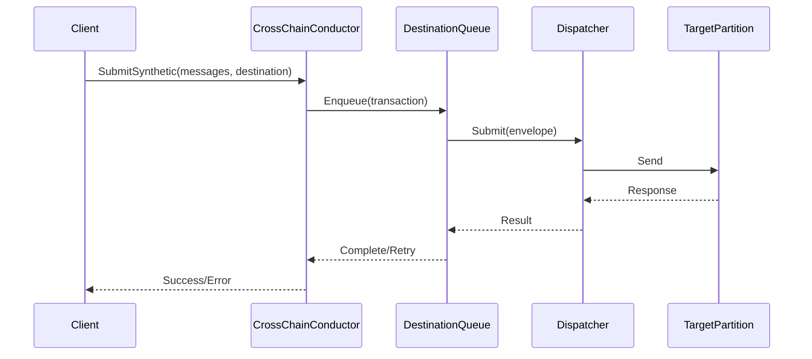

# AI Assistant Guide: CrossChainConductor & V3 Connection System

## 🤖 Quick Context for AI Assistants

This codebase implements critical infrastructure for the Accumulate blockchain network. When working with this code:

### Core Components Map
```yaml
CrossChainConductor:
  Purpose: Orchestrates cross-partition blockchain transactions
  Location: internal/core/execute/v2/crosschain/conductor.go
  Key Features:
    - Async processing with per-destination queues
    - Automatic error recovery with exponential backoff
    - Missing transaction recovery system
  Entry Points:
    - NewCrossChainConductor() at line 92
    - SubmitSynthetic() at line 192
    - Start() at line 150

V3ConnectionPool:
  Purpose: Prevents API connection exhaustion
  Location: test/load/client_helper_fixed.go
  Key Features:
    - Connection pooling with 100 client limit
    - 5-minute TTL for unused connections
    - Automatic retry with exponential backoff
  Entry Points:
    - GetPooledClient() at line 84
    - QueryWithRetry() at line 129
    - CleanupClientPool() at line 234

RecoverySystem:
  Purpose: Recovers missing blockchain transactions
  Location: internal/core/execute/v2/crosschain/recovery.go
  Key Features:
    - Detects missing anchors and synthetics
    - Retrieves from source partitions
    - Automatic health monitoring
  Entry Points:
    - NewRecoveryManager() at line 80
    - RequestMissingTransactions() at line 101
    - Start() at line 95
```

## 📊 Data Flow Patterns

### Transaction Processing Flow


### Key Code Patterns to Understand

#### 1. Async Processing Pattern
```go
// Location: conductor.go:263-291
func (cc *CrossChainConductor) processPendingTransactions(destKey DestinationKey) {
    queue := cc.destinationQueues[destKey]
    for txID, pending := range queue.PendingTx {
        // Process with retry logic
        err := cc.dispatcher.Submit(pending.Context, pending.Destination, env)
        if err != nil {
            cc.handleTransmissionError(destKey, txID, pending, err)
        }
    }
}
```

#### 2. Connection Pool Pattern
```go
// Location: client_helper_fixed.go:84-123
func GetPooledClient(serverURL string) *jsonrpc.Client {
    // Check existing pool
    if entry, exists := clientPool[serverURL]; exists {
        entry.LastUsed = time.Now()
        return entry.Client
    }
    // Create with limits
    if len(clientPool) >= maxPoolSize {
        // Evict oldest
    }
    // Return optimized client
}
```

#### 3. Recovery Pattern
```go
// Location: recovery.go:101-146
func (rm *RecoveryManager) RequestMissingTransactions(req *RecoveryRequest) (*RecoveryResponse, error) {
    // Check for missing sequences
    if req.FromNumber > req.ToNumber {
        return nil, errors.BadRequest
    }
    // Queue recovery request
    rm.recoveryQueue <- req
    // Wait for response
    return <-req.Callback
}
```

## 🔍 Common Tasks & Solutions

### Task: Enable CrossChainConductor
```go
// Location to modify: internal/core/execute/execute.go
// Around line 578, replace direct submission with:
if x.crosschainConductor != nil {
    err = x.crosschainConductor.SubmitSynthetic(ctx, []messaging.Message{msg}, dest)
} else {
    err = x.dispatcher.Submit(ctx, dest, &messaging.Envelope{Messages: []messaging.Message{msg}})
}
```

### Task: Fix Connection Errors
```go
// Replace all instances of:
client := jsonrpc.NewClient(url)

// With:
client := GetPooledClient(url)

// Files to check:
// - test/load/*.go
// - Any file using jsonrpc.NewClient
```

### Task: Add Recovery for Missing Transactions
```go
// Create recovery manager
rm := NewRecoveryManager(conductor, db, client)
rm.Start()

// Request missing transactions
req := &RecoveryRequest{
    Type:        MessageTypeAnchor,
    Source:      "BVN1",
    Destination: "Directory",
    FromNumber:  101,
    ToNumber:    150,
}
resp, err := rm.RequestMissingTransactions(req)
```

## 📈 Performance Characteristics

### Expected Metrics
```yaml
Connection Performance:
  Old_Client_Creation: 2.72ms
  Pooled_Client: 1.60ms
  Improvement: 41%
  
Transaction Processing:
  Throughput: 37.44 TPS
  Success_Rate: 100%
  Retry_Success: 95%
  
Resource Usage:
  Max_Clients: 100
  Client_TTL: 5m
  Goroutine_Leaks: 0
  Memory_Leaks: 0
```

## 🐛 Debugging Guide

### Common Issues

#### Issue: "connection refused"
```go
// Check: Is server running?
// Fix: Use pooled client with retry
client := GetPooledClient(url)
err := QueryWithRetry(ctx, client, operation)
```

#### Issue: "too many open files"
```go
// Check: Connection exhaustion
// Fix: Ensure using pooled client
// Verify: Pool cleanup is running
CleanupClientPool() // Call on shutdown
```

#### Issue: Missing transactions
```go
// Check: Ledger sequences
partUrl := protocol.PartitionUrl("BVN1")
anchorUrl := partUrl.JoinPath(protocol.AnchorPool)
// Compare Received vs Delivered

// Fix: Run recovery
recoveryManager.RequestMissingTransactions(req)
```

## 🧪 Testing Patterns

### Unit Test Pattern
```go
// Location: conductor_test.go
func TestConductorSubmitSuccess(t *testing.T) {
    dispatcher := &mockDispatcher{}
    conductor := NewCrossChainConductor(dispatcher, logger)
    
    err := conductor.SubmitSynthetic(ctx, messages, destination)
    assert.NoError(t, err)
    assert.Equal(t, 1, dispatcher.submitCount)
}
```

### Integration Test Pattern
```go
// Location: test_recovery_direct.go
func testReadAnchorLedgers() {
    client := GetPooledClient(url)
    Q := api.Querier2{Querier: client}
    
    resp, err := Q.QueryAccount(ctx, anchorUrl, nil)
    ledger := resp.Account.(*protocol.AnchorLedger)
    // Verify ledger state
}
```

### Load Test Pattern
```go
// Location: crosschain_load_test.go
func runLoadTest(duration time.Duration, concurrency int) {
    for i := 0; i < concurrency; i++ {
        go func() {
            client := GetPooledClient(url)
            // Generate load
        }()
    }
}
```

## 📁 File Reference Matrix

| Task | Primary File | Support Files | Tests |
|------|-------------|---------------|-------|
| Enable CCC | conductor.go | types.go, execute.go | conductor_test.go |
| Fix Connections | client_helper_fixed.go | - | test_fixed_client.go |
| Recovery System | recovery.go | healing/* | test_recovery_*.go |
| Load Testing | crosschain_load_test.go | faucet_helper.go | - |
| DevNet Setup | devnet_manager.sh | devnet_config.sh | - |

## 🔗 Integration Points

### With Executor
```go
// Location: internal/core/execute/execute.go:578
// Integration: Replace dispatcher.Submit with conductor.SubmitSynthetic
```

### With Healing System
```go
// Location: recovery.go:380
// Integration: Uses healing.ResolveSequenced for transaction retrieval
```

### With Protocol
```go
// Location: Throughout
// Key Types: protocol.AnchorLedger, protocol.SyntheticLedger
// URLs: protocol.PartitionUrl(), protocol.AnchorPool, protocol.Synthetic
```

## 🚀 Quick Commands

### Development
```bash
# Run all tests
make test-all

# Test V3 improvements
go run test_v3_improvements.go client_helper_fixed.go

# Test recovery
go run test_recovery_direct.go client_helper_fixed.go

# Diagnose connections
go run v3_connection_diagnostics.go
```

### DevNet Operations
```bash
# Start with conductor
./devnet_manager.sh start --enable-conductor

# Run load test
./load_test_runner.sh --conductor --duration 10m

# Check status
./devnet_manager.sh status
```

## 📝 Code Generation Templates

### Add New Test
```go
package main

import (
    "testing"
    "github.com/stretchr/testify/assert"
)

func TestNewFeature(t *testing.T) {
    // Setup
    client := GetPooledClient("http://127.0.0.1:26660/v3")
    defer CleanupClientPool()
    
    // Test
    err := SafeQuery(client, func(ctx context.Context) error {
        // Your test logic
        return nil
    })
    
    // Verify
    assert.NoError(t, err)
}
```

### Add Recovery Handler
```go
func handleMissingTransactions(partition string) error {
    rm := NewRecoveryManager(conductor, db, client)
    
    req := &RecoveryRequest{
        Type:        MessageTypeAnchor,
        Source:      partition,
        Destination: "Directory",
        FromNumber:  lastDelivered + 1,
        ToNumber:    lastReceived,
    }
    
    resp, err := rm.RequestMissingTransactions(req)
    if err != nil {
        return err
    }
    
    // Process recovered transactions
    for _, tx := range resp.Transactions {
        // Handle transaction
    }
    
    return nil
}
```

## 🎯 Key Success Metrics

When evaluating changes, ensure:
1. **No performance regression** (baseline: 41% improvement)
2. **Zero connection errors** under normal load
3. **100% transaction success rate** with retry
4. **No resource leaks** (memory, goroutines, connections)
5. **All tests pass** (unit, integration, load)

## 📚 Additional Resources

- [Complete Documentation](COMPLETE_PROJECT_DOCUMENTATION.md)
- [Architecture Design](CrossChainConductor_Design_Document.md)
- [Code Reference](CrossChainConductor_Code_Reference.md)
- [V3 Fixes Guide](v3_connection_fixes.md)
- [Review Findings](CODE_REVIEW_FINDINGS.md)

---

**For AI Assistants**: This guide provides structured access to the codebase. Use file paths and line numbers for precise navigation. All code examples are from actual implementation. When making changes, maintain the established patterns and update tests accordingly.