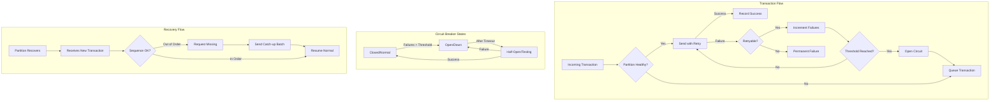

# Partition Failure Handling Design

## Overview

When a partition is down, anchors and synthetic transactions cannot reach it. This design provides a comprehensive solution for handling partition failures, including detection, circuit breaking, queueing, and recovery.

## Key Principles

1. **Stop sending after persistent failures** - Don't waste resources on down partitions
2. **Queue transactions temporarily** - But with limits to prevent memory exhaustion
3. **Detect recovery automatically** - Resume when partition comes back
4. **Handle out-of-order sequences** - Partitions can request missing transactions when they recover
5. **Maintain transaction ordering** - Preserve sequence numbers for consistency

## Architecture



## Component Design

### 1. PartitionHealthMonitor

Tracks health status of all partitions with circuit breaker pattern:

```go
type PartitionStatus struct {
    ID               string
    State            PartitionState     // Healthy, Degraded, Down, Recovering
    CircuitState     CircuitState       // Closed, Open, HalfOpen
    ConsecutiveFails int32
    PendingQueue     []*PendingTransaction
    LastSequenceAck  uint64
}
```

**States:**
- **Healthy**: Normal operation
- **Degraded**: Some failures but still trying
- **Down**: Circuit open, not sending
- **Recovering**: Draining pending queue

### 2. Circuit Breaker Implementation

Three-state circuit breaker per partition:

```go
// Closed (Normal) -> Open (Down) -> Half-Open (Testing) -> Closed
```

**Thresholds:**
- Open circuit after 3 consecutive failures
- Stay open for 30 seconds minimum
- Half-open allows 3 test attempts
- Close circuit on successful test

### 3. Transaction Queueing

When partition is down:

```go
type PendingTransaction struct {
    ID          string
    Message     messaging.Message
    Destination *url.URL
    SequenceNum uint64
    Timestamp   time.Time
    RetryCount  int
}
```

**Limits:**
- Maximum 1000 transactions per partition queue
- Drop oldest if queue full (with logging)
- Preserve sequence ordering

### 4. Out-of-Order Detection

When partition sends transaction with unexpected sequence:

```go
func HandleOutOfOrderSequence(source string, receivedSeq, expectedSeq uint64) {
    if receivedSeq < expectedSeq {
        // Partition is behind - it was down
        // Send catch-up transactions
        SendCatchupBatch(source, receivedSeq, expectedSeq)
    } else {
        // We are behind - request missing
        RequestMissingTransactions(source, expectedSeq, receivedSeq)
    }
}
```

### 5. Recovery Protocol

When partition recovers:

1. **Detection**: Health check succeeds or new transaction arrives
2. **Circuit Half-Open**: Allow test transactions
3. **Catch-up Request**: Partition requests missing sequences
4. **Batch Send**: Send all pending in order
5. **Circuit Closed**: Resume normal operation

## Implementation Details

### Failure Detection

```go
func RecordFailure(partitionID string, err error) {
    status.ConsecutiveFails++
    
    if status.ConsecutiveFails >= threshold {
        status.CircuitState = CircuitOpen
        status.State = PartitionDown
        log.Warn("Partition marked as down", "partition", partitionID)
    }
}
```

### Success Handling

```go
func RecordSuccess(partitionID string, seqNum uint64) {
    status.ConsecutiveFails = 0
    status.LastSequenceAck = seqNum
    
    if status.CircuitState == CircuitHalfOpen {
        status.CircuitState = CircuitClosed
        status.State = PartitionHealthy
        DrainPendingQueue(partitionID)
    }
}
```

### Queue Management

```go
func QueueTransaction(partitionID string, tx *PendingTransaction) error {
    if len(queue) >= maxQueueSize {
        // Log and drop oldest
        log.Error("Queue full, dropping transaction")
        return errors.Unavailable("queue full")
    }
    
    queue = append(queue, tx)
    return nil
}
```

### Catch-up Mechanism

```go
func HandleCatchupRequest(partitionID string, fromSeq uint64) {
    // Find all transactions >= fromSeq
    pending := GetPendingFromSequence(partitionID, fromSeq)
    
    // Sort by sequence number
    sort.Slice(pending, func(i, j int) bool {
        return pending[i].SequenceNum < pending[j].SequenceNum
    })
    
    // Send in batches
    for _, batch := range chunks(pending, 100) {
        SendBatch(partitionID, batch)
    }
}
```

## Configuration

```yaml
partition_health:
  health_check_interval: 10s
  unhealthy_threshold: 3          # Failures before marking down
  circuit_open_duration: 30s      # Minimum time in open state
  half_open_attempts: 3           # Test attempts in half-open
  max_queue_size: 1000            # Per partition queue limit
  recovery_check_interval: 30s    # How often to check recovery
```

## Metrics

Track these metrics for monitoring:

```go
metrics := map[string]interface{}{
    "partitions_healthy":       count,
    "partitions_down":         count,
    "partitions_recovering":   count,
    "total_queued":           count,
    "circuit_breaker_opens":   counter,
    "recovery_attempts":       counter,
    "catchup_requests":        counter,
    "dropped_transactions":    counter,
}
```

## Edge Cases

### 1. Partition Flapping
- Solution: Exponential backoff on circuit reopen
- Minimum time between state changes

### 2. Queue Overflow
- Solution: Drop oldest with logging
- Alert on repeated drops

### 3. Mass Partition Failure
- Solution: Global circuit breaker
- Preserve critical transactions only

### 4. Sequence Gap Detection
- Solution: Bounded recovery window
- Maximum catch-up size

### 5. Recovery Storm
- Solution: Rate limit catch-up sends
- Stagger recovery attempts

## Testing Scenarios

### 1. Single Partition Failure
```go
// Simulate partition down
healthMonitor.SimulatePartitionDown("BVN1")
// Send transactions - should queue
// Bring partition up
healthMonitor.SimulatePartitionUp("BVN1")
// Verify queue drains
```

### 2. Out-of-Order Recovery
```go
// Partition sends seq 150 when we expect 100
HandleOutOfOrderSequence("BVN1", 150, 100)
// Should trigger catch-up for 100-149
```

### 3. Circuit Breaker Transitions
```go
// Test all state transitions
// Closed -> Open -> Half-Open -> Closed
// Verify timing and thresholds
```

## Benefits

1. **Resilience**: System continues operating when partitions fail
2. **Automatic Recovery**: No manual intervention needed
3. **Order Preservation**: Maintains transaction sequencing
4. **Resource Protection**: Prevents exhaustion via circuit breaker
5. **Observability**: Clear metrics on partition health

## Integration Points

### With CrossChainConductor
```go
conductor := NewEnhancedCrossChainConductor(dispatcher, logger)
conductor.Start(partitions)

// Automatically handles partition failures
err := conductor.SubmitTransaction(ctx, msg, dest, seqNum)
```

### With Recovery Manager
```go
// Recovery manager can use health status
if healthMonitor.IsPartitionHealthy(partition) {
    // Normal recovery
} else {
    // Queue for later
}
```

## Summary

This design provides a robust solution for handling partition failures:

1. **Detection**: Circuit breaker pattern detects failures quickly
2. **Protection**: Stops sending to down partitions
3. **Queueing**: Temporarily stores transactions with limits
4. **Recovery**: Automatic detection and catch-up
5. **Ordering**: Maintains sequence consistency

The system gracefully handles partition failures without losing transactions (within queue limits) and automatically recovers when partitions come back online.